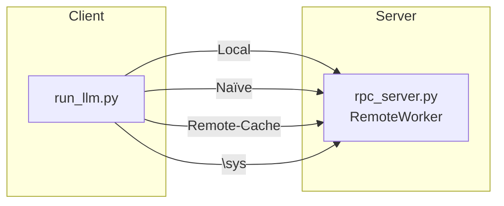
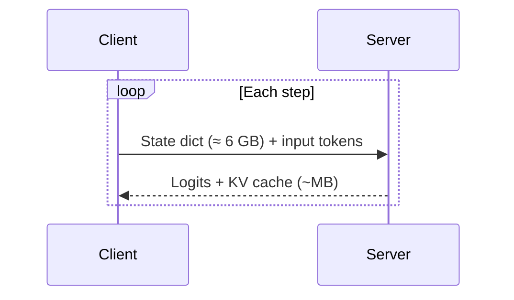
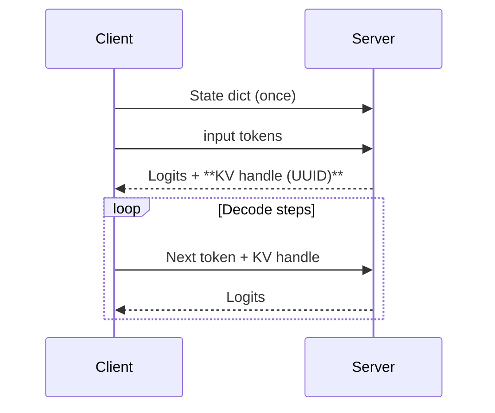
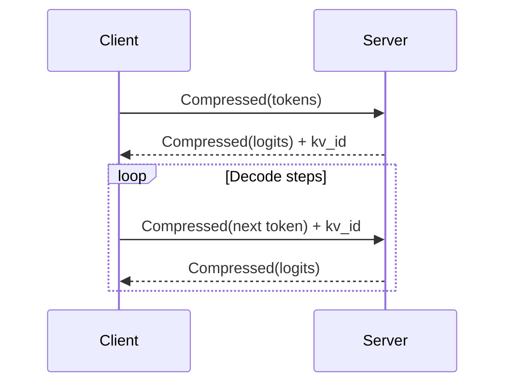

# Framework-Level Semantic Awareness for LLM Inference – Experiment Overview

## Motivation
When the GPU that holds the weights lives on another host, inference requires **shipping tensors across the network**.  By teaching the runtime about *what* is being transferred (its **semantics**) we can avoid redundant or low-value traffic and achieve lower latency.

This repository contains an **end-to-end experiment** that quantifies those benefits.  The codebase implements four execution *modes* and a driver that measures latency, network bytes, and GPU utilisation.

## Execution Modes
| Label (CLI `--mode`) | Description | Traffic Characteristics |
|----------------------|-------------|-------------------------|
| **Local** (`local`) | Model & cache on the *same* GPU.  Upper-bound, no network. | 0 bytes |
| **Semantic-Blind · Naïve** (`naive`) | Every step transfers: **weights + inputs + KV cache + logits**. Slow but simple sanity baseline. | `O(weights + tokens + KV)` per step |
| **Semantic-Blind · Remote-Cache** (`remote_cache`) | 1) Weights copied *once*.<br>2) KV cache **stays on the GPU** and the client only receives an **opaque handle**.<br>3) Tokens & logits sent uncompressed. | `O(tokens + logits)` per step |
| **Framework-Level Semantic-Aware (\sys)** (`sys_simulated`) | Same caching policy as *Remote-Cache* **plus**:<br>a) *Tensor-type aware compression* (fp16-quant + zlib).<br>b) *Delta transfers* of KV cache (future work). | ≪ `O(tokens + logits)` per step |

### Visual Summary


## How Caching Is Designed
### 1. Naïve (Stateless) Path

*Implementation*: `run_stateless_forward()` in `rpc_server.RemoteWorker` **loads weights on every call**.

### 2. Remote-Cache (Semantic-Blind) Path

*Implementation*: `run_prefill_with_handle()` and `run_decode_with_handle()`.  KV cache lives on the GPU; the handle is a tiny string.

### 3. \sys Semantic-Aware Path

*Key techniques*
1. **Type-aware compression** – fp32→fp16, zlib (`_compress_tensor`).
2. **Symmetric codec** on both ends (`_decompress_tensor`).
3. **KV cache stays remote** but stored **CPU-side** to minimise GPU RAM.

## Component Walk-through
1. **`experiment_driver.py`** – orchestrates multi-trial runs, spawns the RPC server, collects `nvidia-smi dmon`, and writes the final CSV results.
2. **`rpc_server.py` / `RemoteWorker`** – executes model forwards on GPU host.  Provides three families of RPC methods:
   • *Stateless* (`run_stateless_forward_remote`)
   • *Semantic-Blind, cached* (`load_weights_remote`, `run_prefill_with_handle`, …)
   • *Semantic-Aware* (`run_prefill_semantic`, `run_decode_step_semantic`)
3. **`run_llm.py`** – client-side driver.  Selects a mode, prepares inputs, measures and prints `NETWORK_BYTES` so the experiment driver can parse them.

## Measurement Pipeline
```mermaid
graph TD
    subgraph Trial "for each (mode, phase, trial)"
        A[experiment_driver.py] -->|spawn| B[rpc_server.py]
        A -->|/usr/bin/time| C[run_llm.py]
        A -->|dmon CSV| D[nvidia-smi dmon]
        C -->|prints metrics| A
    end
    A --> E[results.csv]
```
1. **Latency**: wall-clock via `/usr/bin/time -f %e`.
2. **Network bytes**: client prints `NETWORK_BYTES` measured in-process.
3. **GPU SM util**: parsed from `dmon` CSV (`parse_dmon.py`).

## Reproducing the Experiment
```bash
python experiment_driver.py \
    --trials 3 \
    --gpu_host 127.0.0.1 \
    --master_port 29501 \
    --model EleutherAI/gpt-j-6B \
    --output results.csv
```
Add `--modes local,remote_cache,sys_simulated` to run a subset, or `--external_server` if you started `rpc_server.py` manually.

## Future Extensions
* **Better codecs** – e.g., sparsity-aware or Nvidia NVCOMP.
* **Cross-request semantic batching**.
* **Real 2-node deployment** to capture NIC/PCIe characteristics.

---